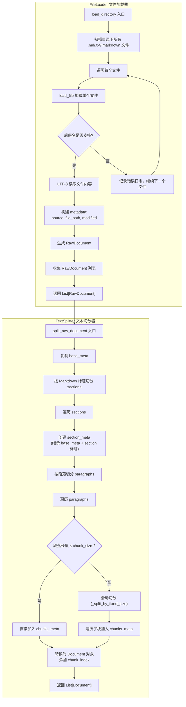

```mermaid
flowchart TD
    %% 文件加载阶段
    subgraph FileLoader["FileLoader 文件加载器"]
        LoadDir["load_directory 入口"]
        ScanFiles["扫描目录下所有 .md/.txt/.markdown 文件"]
        LoopFiles["遍历每个文件"]
        LoadSingle["load_file 加载单个文件"]
        CheckExt{"后缀名是否支持?"}
        ReadFile["UTF-8 读取文件内容"]
        BuildMeta["构建 metadata:<br>source, file_path, modified"]
        GenRawDoc["生成 RawDocument"]
        HandleErr["记录错误日志，继续下一个文件"]
        CollectRaw["收集 RawDocument 列表"]
        ReturnRaw["返回 List[RawDocument]"]
    end

    %% 文本切分阶段
    subgraph TextSplitter["TextSplitter 文本切分器"]
        Entry["split_raw_document 入口"]
        CopyBaseMeta["复制 base_meta"]
        SectionSplit["按 Markdown 标题切分 sections"]
        LoopSections["遍历 sections"]
        CreateSectionMeta["创建 section_meta<br>(继承 base_meta + section 标题)"]
        ParaSplit["按段落切分 paragraphs"]
        LoopParas["遍历 paragraphs"]
        CheckLen{"段落长度 ≤ chunk_size ?"}
        DirectAdd["直接加入 chunks_meta"]
        FixedSplit["滑动切分 (_split_by_fixed_size)"]
        AddSub["遍历子块加入 chunks_meta"]
        BuildDocs["转换为 Document 对象<br>添加 chunk_index"]
        ReturnDocs["返回 List[Document]"]
    end

    %% 数据流连接
    LoadDir --> ScanFiles --> LoopFiles
    LoopFiles --> LoadSingle --> CheckExt
    CheckExt -- "是" --> ReadFile --> BuildMeta --> GenRawDoc
    CheckExt -- "否" --> HandleErr
    GenRawDoc --> CollectRaw
    HandleErr --> LoopFiles
    CollectRaw --> ReturnRaw

    ReturnRaw --> Entry
    Entry --> CopyBaseMeta --> SectionSplit --> LoopSections
    LoopSections --> CreateSectionMeta --> ParaSplit --> LoopParas
    LoopParas --> CheckLen
    CheckLen -- "是" --> DirectAdd
    CheckLen -- "否" --> FixedSplit --> AddSub
    DirectAdd --> BuildDocs
    AddSub --> BuildDocs
    BuildDocs --> ReturnDocs
```